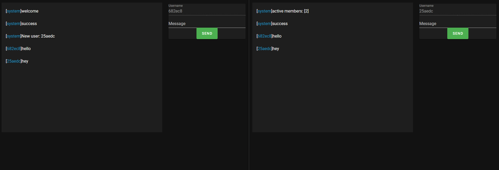

# [gopherjs-nano | nanojs](https://github.com/revzim/gopherjs-nano)

## simple gopherjs wrapper for the [nano golang game framework](https://github.com/lonng/nano) [client sdk](https://github.com/nano-ecosystem/nano-websocket-client)

## IMPORTANT
### DO NOT INCLUDE NANO (STARX) CLIENT SIDE, THIS LIBRARY WILL AUTO INJECT THE CLIENT SDK

# [web app /example](https://github.com/revzim/gopherjs-nano/tree/master/example)
