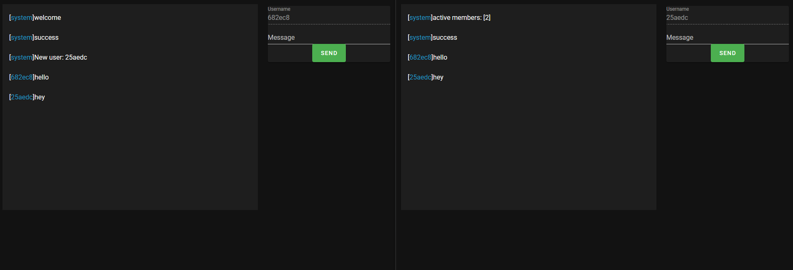

# [gopherjs-nano | nanojs web app example](https://github.com/revzim/gopherjs-nano)

### GOPHERJS EXAMPLE OF A PRETTY MUCH 1:1 OF THE ORIGINAL CHAT EXAMPLE
[ORIGINAL NANO CHAT EXAMPLE](https://github.com/lonng/nano/tree/master/examples/demo/chat)
* clone project `git clone https://github.com/revzim/gopherjs-nano`
* `go mod tidy`
* `cd example`
	* EDIT & REBUILD GOPHERJS NANO CLIENT EXAMPLE: `buildjs.sh`
* RUN WEBSERVER & GAMESERVER: `go run main.go`
* OPEN UP http://localhost:8080 TO TEST EXAMPLE
* [ORIGINAL NANO CHAT EXAMPLE](https://github.com/lonng/nano/tree/master/examples/demo/chat)